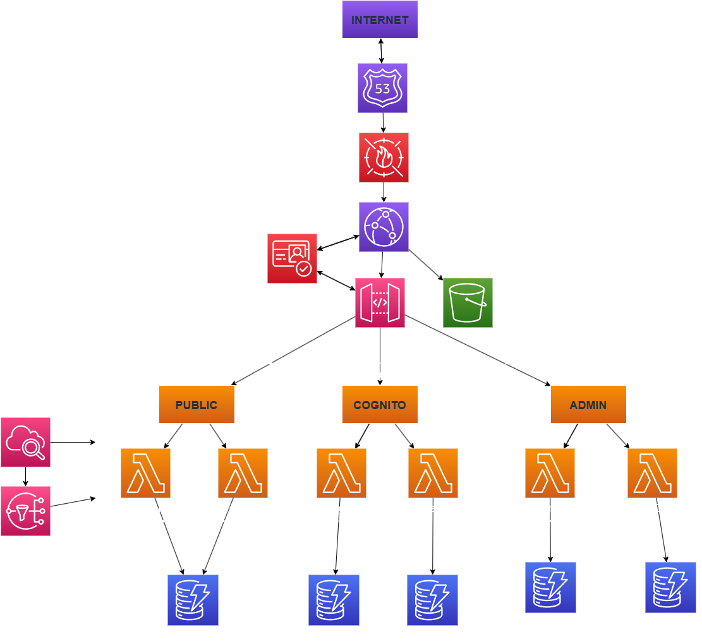

# SportShop - E-commerce Web Application

## 📋 Project Description

Clothing store web application designed to showcase products to customers and serve as a real-world project for learning Solutions Architect work.

## 🎯 Objectives

- Build a functional online store
- Implement scalable AWS architecture
- Apply Solutions Architecture best practices
- Maintain optimized costs

## 👥 Users and Roles

- **Visitor/Customer**: View catalog, search products, view details, contact
- **Authenticated Customer**: Make purchases and leave reviews
- **Administrator**: Manage products, prices, orders and messages

## ⚡ MVP Features

- ✅ Product catalog (public viewing)
- ✅ Shopping cart
- ✅ Login/Registration system
- ✅ Contact form
- ✅ Review system

## 💳 Purchase Model

- Order registration without online payment
- WhatsApp redirection for direct coordination
- Payment management outside the web platform

## 🏗️ Architecture

### Design Principles
- **Automatic scalability**
- **Managed services** (avoid server management)
- **High availability** with cost-benefit focus
- **Security** with HTTPS and authentication

### Planned Technologies
- Frontend: React/Next.js
- Backend: AWS Lambda + API Gateway
- Database: DynamoDB
- Storage: S3 + CloudFront
- Authentication: AWS Cognito

### 📐 Architecture Diagram



For a detailed view of the system architecture, please open the `Architecture_L0.drawio` file using the [draw.io extension](https://marketplace.visualstudio.com/items?itemName=hediet.vscode-drawio) in VS Code or visit [draw.io](https://app.diagrams.net/) online.

The L0 diagram shows:
- Complete serverless architecture flow
- AWS services integration
- User interaction patterns
- Security and scalability design

### 🏗️ Infrastructure as Code

This project uses **AWS CDK with TypeScript** for infrastructure management:

```
infrastructure/
├── bin/sportshop.ts           # Entry point
├── lib/stacks/                # Domain-separated stacks
│   ├── data-stack.ts          # DynamoDB tables
│   ├── compute-stack.ts       # Lambda functions
│   ├── api-stack.ts           # API Gateway
│   ├── frontend-stack.ts      # S3 + CloudFront
│   └── auth-stack.ts          # Cognito authentication
├── lib/config/                # Environment configurations
└── lib/constructs/            # Reusable components
```

**Benefits of this approach:**
- ✅ **Professional structure** with domain separation
- ✅ **Type safety** with TypeScript
- ✅ **Reusable components** and best practices
- ✅ **Multi-environment** support (dev/prod)
- ✅ **Version control** for infrastructure

## 🔒 Security

- Mandatory HTTPS traffic
- Authentication for purchases and reviews
- Role separation (Admin vs Customer)
- Sensitive data protection

## 📊 Observability

- ✅ CloudWatch monitoring
- ✅ Centralized logs
- ✅ Critical alerts (email/WhatsApp)
- ❌ Automatic backups (disabled for cost)

## 💰 Cost Approach

- Priority on **minimum cost**
- Use **Free Tier** when possible
- Scalability without unnecessary overhead
- Pay-per-use services

## 🚀 Roadmap

### Phase 1: MVP
- [ ] Basic infrastructure setup
- [ ] Frontend with catalog
- [ ] Authentication system
- [ ] Basic cart

### Phase 2: Core Features
- [ ] Order system
- [ ] WhatsApp integration
- [ ] Administration panel
- [ ] Review system

### Phase 3: Optimization
- [ ] CDN for images
- [ ] Performance optimization
- [ ] Advanced monitoring
- [ ] Load testing

## 📁 Project Structure

```
SportShop/
├── frontend/            # React/Next.js application
├── backend/             # Lambda functions
├── infrastructure/      # IaC code (CloudFormation/CDK)
└── docs/               # Additional documentation
```

## 🛠️ Installation and Development

```bash
# Clone repository
git clone https://github.com/AndresAlvarez564/SportShop.git
cd SportShop

# Install dependencies (when added)
npm install

# Run in development
npm run dev
```

## 📝 Contributing

This is a learning project. Contributions are welcome following development best practices.

## 📄 License

MIT License - See LICENSE file for more details.